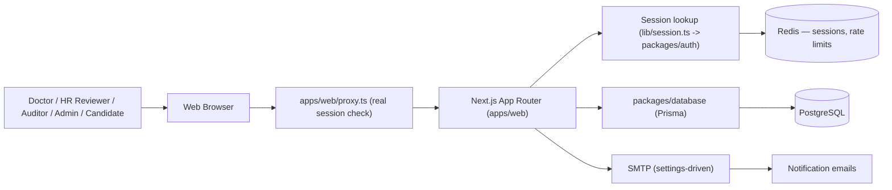

# National Commercial Bank Jamaica Medical Platform Architecture

## 1. Purpose

The National Commercial Bank Jamaica Medical Platform manages the pre-employment
medical onboarding case lifecycle: HR creates a candidate and medical case, the
candidate completes intake and consent, a medical office/doctor completes the
physician assessment, HR reviews the completed medical, and billing is tracked
through paid/unpaid status.

## 2. User Roles

| Role | Description | Main Capabilities |
| --- | --- | --- |
| Admin | System administrator | Full access except a hardened boundary on account management (can't create other admins or delete themself if that ever changes) and Settings, plus everything below |
| Reviewer (HR) | NCB HR team member | Manage cases, candidates, doctors, medical offices, users (short of admin accounts), notifications, review queue |
| Auditor | Read-only oversight tier | Same visibility as Reviewer, none of the write permissions |
| Clinician / Doctor | Medical office user | Complete assigned assessments, manage assigned-candidate roster |
| Delegate | Assistant acting on behalf of exactly one doctor | Same case access as that one doctor's own cases, never the doctor's own determination/attestation/signature or final submission |
| Patient | Candidate completing intake | Complete intake/consent for their own case only |

Role defaults are defined in `apps/web/lib/permissions.ts` and `apps/web/lib/permission-groups.ts`.
Admins can edit role defaults and grant/revoke per-user permission overrides from
Settings → Permissions (`apps/web/features/settings/components/permissions-matrix.tsx`);
a small set of permissions (`USERS_MANAGE`, `SETTINGS_MANAGE`, `ROLES_MANAGE`) are
excluded from that editable surface and enforced server-side regardless of what's
sent from the client.

## 3. Technology Stack

| Layer | Technology |
| --- | --- |
| Runtime | Node.js 20+ |
| Framework | Next.js 16 (App Router), React 19, Turbopack |
| Monorepo | npm workspaces + Turborepo (`apps/web`, `packages/database`, `packages/auth`, `packages/redis`, `packages/shared`) |
| Database | PostgreSQL via Prisma (`packages/database`) |
| Sessions / cache | Redis (`packages/redis`) — Better Auth sessions and login/action rate limiting |
| Encryption at rest | AES-256-GCM, keyed by `APP_MASTER_KEY` (`packages/shared/src/crypto-box.ts`), applied in the candidates/cases/submissions/settings/audit/users repositories |
| Authentication | Better Auth (`packages/auth`) — native email/password, Redis-backed sessions, HttpOnly/SameSite=Strict cookies |
| Email | SMTP, configured through the Settings admin UI (not env vars) and stored in the database |
| Styling/UI | Tailwind CSS, shadcn/ui-derived components (`apps/web/components/ui`) |

## 4. High-Level Architecture

`proxy.ts` (Next 16's `middleware` successor) runs a real `auth.api.getSession()`
check and redirects to `/login` if it fails — it runs on the Node runtime, so
it can reach Redis directly rather than only checking cookie presence. The
real authorization boundary is `getSession()` (`apps/web/lib/session.ts`),
which every Server Component/Action calls to resolve the user's actual
permissions (role defaults plus any per-user overrides) before doing anything.

## 5. Main Data Flows

### 5.1 Case Intake

1. HR reviewer creates a candidate profile and a medical case, assigning it to
   a doctor/medical office.
2. The candidate completes intake and consent (`apps/web/features/submissions`).
3. The doctor completes the physician assessment (`apps/web/features/cases`,
   `apps/web/features/submissions/components/doctor-case-form`).

### 5.2 Review and Billing

1. HR reviewer opens the review queue, reviews the completed case
   (`apps/web/features/cases/components/complete-review-card.tsx`), and
   transitions its status.
2. Billing is tracked through paid/unpaid confirmation
   (`apps/web/features/cases/components/case-payment-confirmation.tsx`).
3. Every write is recorded to the audit log (`packages/database/src/repositories/audit.ts`).

### 5.3 Notifications

Notification templates (rich-text, DB-backed) fire on case events — assignment,
submission, review outcome — via `apps/web/features/notifications`. SMTP
settings are configured per-deployment through Settings → Mail, not environment
variables; without SMTP configured, sends fail visibly rather than silently
falling back (see `send-test-email` for verifying configuration before relying
on it).

## 6. Data Storage

| Data | Where | Protection |
| --- | --- | --- |
| Users, roles, permission overrides | Postgres (`AppUser`, `role_permissions`, per-user overrides) | Session-embedded permission snapshot, scrypt-hashed passwords |
| Candidates, cases, submissions | Postgres | AES-256-GCM encrypted payload columns, indexed workflow metadata alongside |
| Settings (branding, SLA, mail, templates) | Postgres | Encrypted where sensitive (e.g. SMTP password) |
| Audit log | Postgres, append-only | No medical details by design |
| Master encryption key | `APP_MASTER_KEY` env var, or generated and persisted to `apps/web/data/master.key` if unset | File permissions or environment secret |

## 7. Security Controls

- Role-based access control with per-user permission overrides, resolved once
  per session and embedded in it (avoids a DB round-trip per request).
- HttpOnly, SameSite session cookies; `COOKIE_SECURE` for HTTPS deployments.
- One active session per account: signing in from a new device revokes every other session for
  that account immediately, with an email notice sent after the fact (the code already proved it
  was really them). An unrecognized device must first enter a 6-digit code emailed to the account
  holder before a session is created at all; a device that passed this check once is remembered
  for 30 days. Implemented via Better Auth's `two-factor` OTP plugin
  (`packages/auth/src/index.ts`, `apps/web/features/auth/actions/login.ts` and
  `verify-device-code.ts`) — every account has this enabled by default (`AppUser.twoFactorEnabled`),
  not an opt-in.
- AES-256-GCM encryption at rest for candidate/case/submission payloads.
- No medical details in email notifications.
- Append-only audit log, kept separate from the encrypted medical data it references, cross-checked
  against an independent Redis checkpoint on every append so a database-only compromise can't
  retroactively rewrite history undetected (see `DATABASE.md`'s Security requirements).
- Three separate Postgres roles by function — migrations/ownership, the deployed app's own runtime
  queries, and audit-log writes — so a compromise of the live app's own credential can't touch
  audit history at all, not merely by policy (see `DATABASE.md`'s Configuration section).
- Auditor role provides read-only oversight without needing write access to anything.
- Case-level authorization is checked per case, not just per role: a clinician's or delegate's
  broad "can see cases" permission is additionally scoped to cases actually assigned to them
  (`matchesClinicianAssignment`, `apps/web/features/cases/case-authorization.ts`), and a patient's
  to their own linked candidate record (`patientOwnsCase`) — both enforced server-side on every
  case-detail view, submission action, and attachment access, not just in the UI.

## 8. Deployment

See [README.md](README.md) for local/Docker setup and [DATABASE.md](DATABASE.md)
for the Postgres/Prisma details. `Dockerfile`/`docker-compose.yml` build and run
the actual Next.js app, deployed onto the organization's own infrastructure —
there is no third-party PaaS config in this repo. Migrations run as their own
explicit step (a one-shot `migrate` service in Compose) rather than on every
app start.

## 9. Known Gaps

- `packages/database/src/scripts/seed-users.ts` is a local-dev-only seed with a
  hardcoded demo password — use `db:create-admin` (see README.md) for a real
  first admin account instead.
