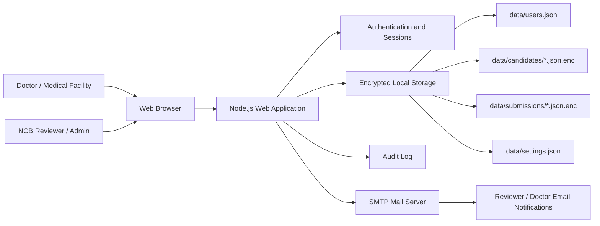
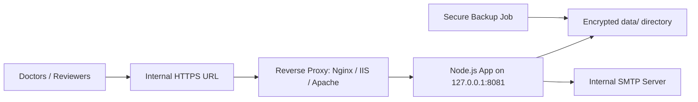

# National Commercial Bank Jamaica Medical Platform Architecture

## 1. Purpose

The National Commercial Bank Jamaica Medical Platform is an internal web application for managing new-hire medical assessments. It replaces the manual process where a medical facility completes a paper form, scans it, and emails it to the National Commercial Bank Jamaica team.

The platform allows:

- Reviewers to create doctor accounts and new-hire profiles.
- Doctors to select assigned new hires, complete the medical assessment, and submit the form securely.
- Reviewers to view, review, file/archive, and download submitted medical forms.
- Administrators to manage users, notification settings, and platform wording.

## 2. User Roles

| Role | Description | Main Capabilities |
| --- | --- | --- |
| Doctor / Medical Clinician | External or internal medical professional completing assessments | Sign in, select assigned new hire, complete medical form, upload signature, submit assessment |
| Reviewer | National Commercial Bank Jamaica team member reviewing submitted forms | Create doctor accounts, create new-hire profiles, assign profiles to doctors, review submissions, download forms, track monthly doctor volumes |
| Administrator | System administrator / HR platform owner | Manage users, roles, passwords, portal settings, notification emails, and all reviewer functions |

## 3. Current Technology Stack

| Layer | Technology |
| --- | --- |
| Runtime | Node.js 20+ |
| Backend | Native Node.js HTTP server |
| Frontend | HTML, CSS, vanilla JavaScript |
| Storage | Local encrypted JSON files under `data/` |
| Encryption | AES-256-GCM for medical submissions and candidate profiles |
| Authentication | Local user accounts with PBKDF2-SHA256 password hashing |
| Sessions | HttpOnly SameSite cookies |
| Email | SMTP integration, with local notification logging when SMTP is not configured |

The current application is self-contained and does not require a database server. For production scale, the encrypted file storage can later be replaced by a managed database.

## 4. High-Level Architecture



## 5. Main Data Flows

### 5.1 New-Hire Setup Flow

1. Reviewer or administrator signs in.
2. Reviewer opens **Doctor & new hire setup**.
3. Reviewer creates or selects a doctor account.
4. Reviewer creates a new-hire profile with candidate details.
5. Reviewer assigns the new hire to a doctor.
6. The candidate profile is encrypted and stored in `data/candidates/`.
7. A doctor assignment notification is sent by SMTP, or logged locally if SMTP is not configured.

### 5.2 Doctor Assessment Flow

1. Doctor signs in.
2. Doctor opens **New assessment**.
3. Doctor selects an assigned new hire.
4. Candidate details auto-populate into the form.
5. Doctor completes assessment details, determination, attestation, and optional signature upload.
6. Doctor submits the assessment.
7. The completed form is encrypted and stored in `data/submissions/`.
8. The assigned candidate profile is marked as submitted.
9. Reviewer notification is sent by SMTP, or logged locally if SMTP is not configured.

### 5.3 Reviewer Review Flow

1. Reviewer signs in.
2. Reviewer opens **Review queue**.
3. Reviewer selects a submitted assessment.
4. Reviewer reviews the form content.
5. Reviewer updates status to pending, reviewed, needs follow-up, or archived.
6. Reviewer can download the populated assessment form.

## 6. Data Storage

| Data | Path | Protection |
| --- | --- | --- |
| Users | `data/users.json` | File permissions, hashed passwords |
| New-hire candidate profiles | `data/candidates/*.json.enc` | AES-256-GCM encrypted |
| Medical submissions | `data/submissions/*.json.enc` | AES-256-GCM encrypted |
| App settings | `data/settings.json` | File permissions |
| Master encryption key | `data/master.key` or `APP_MASTER_KEY` | File permissions or environment secret |
| Audit log | `data/audit.log` | No medical details by design |
| Notification log | `data/notifications.log` | Used when SMTP is not configured |

## 7. Security Controls

Current controls include:

- Role-based access control for doctors, reviewers, and administrators.
- Password hashing using PBKDF2-SHA256.
- HttpOnly session cookies.
- SameSite session cookies.
- CSRF token validation for write operations.
- AES-256-GCM encryption at rest for medical submissions and candidate profiles.
- No medical details included in email notifications.
- Audit logging for key events.
- Security headers including `X-Frame-Options`, `X-Content-Type-Options`, `Referrer-Policy`, and Content Security Policy.
- Local data directory permissions are restricted where supported by the operating system.

## 8. Email Notifications

The platform supports two notification paths:

| Notification | Trigger | Recipient Setting |
| --- | --- | --- |
| Doctor assignment notification | New-hire profile assigned to doctor | Doctor account email plus optional doctor notification copy email(s) |
| Reviewer submission notification | Doctor submits medical assessment | Reviewer notification email(s) |

If SMTP is not configured, notifications are written to `data/notifications.log`.

## 9. Deployment Architecture

Recommended internal deployment:



Recommended internal URL example:

```text
https://ncb-medical.internal
```

The reverse proxy should terminate HTTPS and forward traffic to:

```text
http://127.0.0.1:8081
```

## 10. Production Configuration

Recommended `.env` values:

```bash
HOST=127.0.0.1
PORT=8081
PUBLIC_URL=https://ncb-medical.internal
COOKIE_SECURE=true
APP_MASTER_KEY=<32-byte-base64-secret-from-vault>
REVIEW_NOTIFICATION_EMAIL=hr-review@jncb.com
FROM_EMAIL=no-reply@jncb.com
SMTP_HOST=<internal-smtp-host>
SMTP_PORT=587
SMTP_SECURE=false
SMTP_USER=<smtp-user-if-required>
SMTP_PASS=<smtp-password-if-required>
```

## 11. Production Readiness Checklist

Before live medical data is used:

- Deploy behind HTTPS only.
- Set `COOKIE_SECURE=true`.
- Store `APP_MASTER_KEY` in a secure secret vault.
- Do not rely on `data/master.key` for production secrets.
- Restrict network access to approved users and facilities.
- Configure SMTP for real notifications.
- Create secure backups for the `data/` directory.
- Test restore procedures.
- Define retention and deletion rules for candidate profiles and medical forms.
- Replace local user accounts with company SSO if required.
- Conduct privacy, legal, and information-security reviews.
- Run penetration/security testing before production rollout.

## 12. Operational Notes

The application can be started with:

```bash
node server.js
```

For production, IT should run it as a managed service using `systemd`, PM2, Windows Service Manager, or an approved enterprise service manager.

The `data/` directory must be treated as confidential because it contains encrypted medical records, application users, audit logs, and configuration.

## 13. Future Enhancements

Potential future improvements:

- Company single sign-on integration.
- Database-backed encrypted storage.
- Role-specific dashboards and analytics.
- Formal password reset email workflow.
- PDF generation instead of HTML downloads.
- Facility-level access controls.
- Automated retention and archival policies.
- Admin audit report exports.
- Integration with HR onboarding systems.
